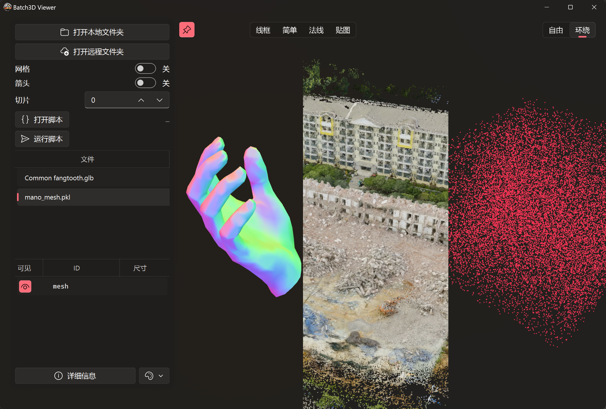

# Batch 3D Viewer - 批量3D查看器
一款用于批量查看本地或远程3D数据的工具。



### 安装依赖
首先，请确保安装了所有必需的依赖项：
```bash
pip install -r requirements.txt
```
### 启动程序
启动Batch 3D Viewer的方法有以下两种：
1. 双击 `run.bat` 文件；
2. 在命令行中运行 `python Batch3D.py`。
### 打开目录及文件载入
1. 点击“打开本地文件夹”按钮或拖入文件夹/文件至窗口，文件名将会显示在右侧列表中。
2. 单击列表项或使用键盘的上下箭头快速切换文件。
3. 双击列表项可重新载入该文件。
### 远程服务器文件查看
1. 点击“打开远程文件夹”按钮，输入服务器的IP地址、用户名和密码等信息。
2. 软件将连接到服务器并下载文件以供查看。
## 文件要求
### 支持的存储格式
本查看器支持以下文件格式：`.pkl`, `.npy`, `.npz`, `.ply`, `.obj`, `.stl` 等。
`.pkl`, `.npy`, `.npz` 文件应采用二进制形式保存字典类型数据，字典值建议使用 `numpy.ndarray` 或`dict`类。以下是一个示例：
```python
import pickle
import numpy as np
save_dt = {
    'pcd1_#00FF00': np.random.rand(100, 3),  # 点云
    'pcd2_#888888': np.random.rand(5, 100, 3),  # 点云
    'line1_#123456': np.random.rand(5, 100, 2, 3),  # 线段
    'bbox1_#123456': np.array([
        [[0, 0, 1],
        [0, 1, 1],
        [1, 1, 1],
        [1, 0, 1],
        
        [0, 0, 0],
        [0, 1, 0],
        [1, 1, 0],
        [1, 0, 0],]
        ]),  # 包围框
    'mesh': {
        'vertex': np.random.rand(233, 3), # 或(N, 6) (N, 7)
        'face':   np.random.randint(0, 233, size=(514, 3)),
    }
}
with open("test.pkl", 'wb') as f:
    pickle.dump(save_dt, f)
```
保存后，查看器即可解析 `test.pkl` 文件。
### 数据格式说明
#### 类型识别
对于 `.pkl`, `.npy`, `.npz` 文件，有以下显示类型：
1. 点云：`ndarray`，形状为 `(..., N, 3)`, `(..., N, 6)` 或 `(..., N, 7)`，其中 $N > 2$；
2. 线条：`ndarray`，键中需包含`line`字符串，形状为 `(..., 2, 3)`；
3. 包围框：`ndarray`，键中需包含`bbox`字符串形状为 `(..., 8, 3)`；
4. 齐次变换：`ndarray`，形状为 `(..., 4, 4)`；
5. 网格：`dict`，必须包含两个键：
    1. `vertex`，值为`ndarray`，形状为 `(N, 3)`, `(N, 6)` 或 `(N, 7)`，网格顶点xyz，xyzrgb或xyzrgba，
    2. `face`，值为`ndarray`，形状为 `(M, 3)`，网格顶点索引，整形。

其他类型的数据暂不支持。
#### 批次处理
对于 `.pkl`, `.npy`, `.npz` 文件，高维数据将被识别为批次数据，可进行切片分别显示。当切片选项设置为-1时，软件会将高维数据进行合并显示。若切片选项为其他值，软件将按第一个维度进行切片显示，其余维度合并显示。
#### 颜色指定
对于 `.pkl`, `.npy`, `.npz` 文件，可以通过在键名后添加 `'#HHHHHH'` 或 `'#HHHHHHHH'` 的16进制颜色代码来指定点云、线条、包围框的颜色。若未指定，系统将自动分配颜色。
对于点云和网格的顶点，还可以将每个点的颜色属性拼接为 `(x, y, z, r, g, b)` 或 `(x, y, z, r, g, b, a)`，即维度为 `(..., N, 6)` 或 `(..., N, 7)`。
## 运行脚本
请参考 `example/` 文件夹中的示例脚本。
