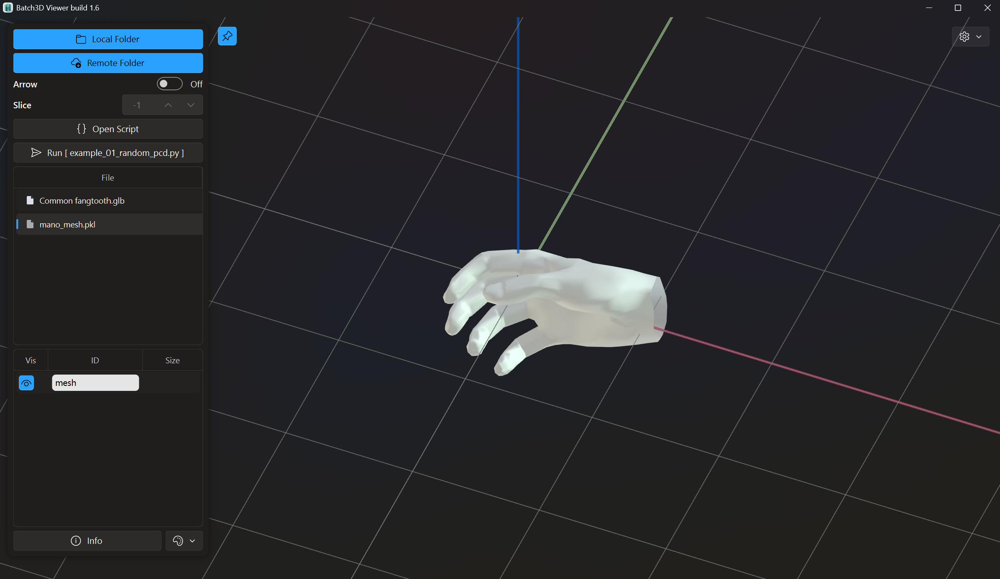

**[English](README.md), [Chinese](README_zh.md)**

# Batch 3D Viewer
A tool for batch viewing local or remote 3D data.



## Launch
### Install Dependencies
First, ensure all required dependencies are installed:
```bash
pip install -r requirements.txt
```

### Start the Program
There are two methods to launch Batch 3D Viewer:
- Double-click the run.bat file;
- Run python Batch3D.py in the command line.

### Open Directory and File Loading
1. Click the "Open Local Folder" button or drag a folder/file into the window. Filenames will appear in the right-side list.
2. Click list items or use the keyboard's up/down arrows to switch files quickly.
3. Double-click a list item to reload the file.

### View Remote Server Files
1. Click the "Open Remote Folder" button and enter the server’s IP address, username, password, and other information.
2. The software will connect to the server and download files for viewing.

## How to Save Viewable Data

### File Formats and Organization

This viewer supports the following formats: `.pkl`, `.npy`, `.npz`, `.ply`, `.obj`, `.stl`, `.h5` etc.

1. `.pkl`, `.npy`, `.npz` files should store dictionary-type data in binary format. Values should use `numpy.ndarray` or `dict` classes. Example:

```Python
import pickle
import numpy as np
save_dt = {
    'pcd1_#00FF00': np.random.rand(100, 3),  # Point cloud
    'pcd2_#888888': np.random.rand(5, 100, 3),  # Point cloud
    'line1_#123456': np.random.rand(5, 100, 2, 3),  # Line segments
    'bbox1_#123456': np.array([
        [[0, 0, 1],
        [0, 1, 1],
        [1, 1, 1],
        [1, 0, 1],
        
        [0, 0, 0],
        [0, 1, 0],
        [1, 1, 0],
        [1, 0, 0],]
        ]),  # Bounding box
    'mesh': {
        'vertex': np.random.rand(233, 3), # or (N, 6), (N, 7)
        'face':   np.random.randint(0, 233, size=(514, 3)),
    }
}
with open("test.pkl", 'wb') as f:
    pickle.dump(save_dt, f)
```
The viewer can then parse the `test.pkl` file.

2. HDF5

For HDF5 files, use the following organization. Please refer to [example](example\example_04_read_HDF5_file.py) for details:

```
+-- /（HDF5 root）
|   +-- group_1
|   |   +-- dataset_1_1
|   |   |   +-- key1: np.ndarray
|   |   |   +-- key2: np.ndarray
|   |   +-- dataset_1_2
|   |   |   +-- key1: np.ndarray
|   |   |   +-- key2: np.ndarray
|   |   |   +-- ...
|   |   +-- ...
|   +-- group_2
|   |   +-- ...
|   +-- ...
```

### Data Dimensions
#### Dimension and Type Recognition

For `.pkl`, `.npy`, `.npz`, `.h5` files, the software automatically determines display methods based on array dimensions and key identifiers:

- Point Cloud: ndarray with shape `(..., N, 3)`, `(..., N, 6)` or `(..., N, 7)`，where $N > 2$；;

- Line: ndarray with keys containing line and shape `(..., 2, 3)`;

- Bounding Box: ndarray with keys containing bbox and shape `(..., 8, 3)`;

- Homogeneous Transformation: ndarray with shape `(..., 4, 4)`;

- Mesh: dict containing two keys:

    1. vertex: ndarray with shape `(N, 3)`, `(N, 6)`, or `(N, 7)` (mesh vertex xyz, xyzrgb, or xyzrgba);

    2. face: ndarray with shape `(M, 3)` (mesh vertex indices, integer type).

Other data types are currently unsupported.

#### Batch Processing

- For `.pkl`, `.npy`, `.npz` files: Higher-dimensional data is treated as batch data for sliced display. When the slice index is set to `-1`, the software merges all dimensions for display. For other slice values, the first dimension is sliced while others are merged.

- For `.h5` files: Each group under the root directory is treated as a data group for sliced display. Use the slice index to select groups. When set to `-1`, the first group is displayed.

Note: To ensure slice order matches the group-saving order, write HDF5 files with `track_order=True`.

#### Color Specification
For `.pkl`, `.npy`, `.npz`, `.h5` files, append `#HHHHHH` or `#HHHHHHHH` hexadecimal color codes to keys to specify colors for point clouds, lines, or bounding boxes. If unspecified, colors are automatically assigned.

For point clouds and mesh vertices, colors can also be embedded as `(x, y, z, r, g, b)` or `(x, y, z, r, g, b, a)` (i.e., dimensions `(..., N, 6)` or `(..., N, 7)`).

## Run Scripts

Refer to example scripts in [example1](example\example_01_read_ply.py), [example2](example\example_02_random_pcd.py), [example3](example\example_03_trimesh_obj.py)