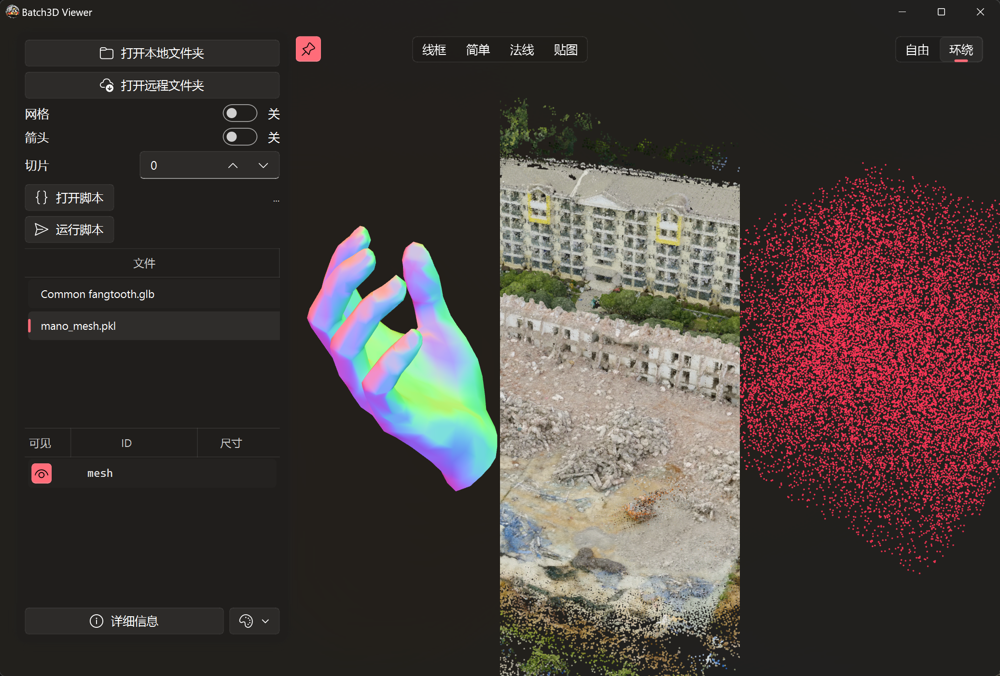

**[Englich](README.md), [Chinese](README_zh.md)**

# Batch3D
一款用于批量查看本地或远程3D数据的工具。



## 启动
### 安装依赖
首先，请确保安装了所有必需的依赖项：
```bash
pip install -r requirements.txt
```
### 启动程序
启动 Batch3D 的方法有以下两种：
1. 双击 `run.bat` 文件；
2. 在命令行中运行 `python Batch3D.py`。
### 打开目录及文件载入
1. 点击“打开本地文件夹”按钮或拖入文件夹/文件至窗口，文件名将会显示在右侧列表中。
2. 单击列表项或使用键盘的上下箭头快速切换文件。
3. 双击列表项可重新载入该文件。
### 远程服务器文件查看
1. 点击“打开远程文件夹”按钮，输入服务器的IP地址、用户名和密码等信息。
2. Batch3D 将连接到服务器并下载文件以供查看。

## 如何保存需要查看的数据
### 文件格式与组织
Batch3D 支持以下文件格式：`.pkl`, `.npy`, `.npz`, `.ply`, `.obj`, `.stl`等。

1. `.pkl`, `.npy`, `.npz` 文件应采用二进制形式保存字典类型数据，字典值建议使用 `numpy.ndarray` 或`dict`类。以下是一个示例：
```python
import pickle
import numpy as np
save_dt = {
    'pcd1_#00FF00': np.random.rand(100, 3),  # 点云
    'pcd2_#888888': np.random.rand(5, 100, 3),  # 点云
    'line1_#123456': np.random.rand(5, 100, 2, 3),  # 线段
    'bbox1_#123456': np.array([
        [[0, 0, 1],
        [0, 1, 1],
        [1, 1, 1],
        [1, 0, 1],
        
        [0, 0, 0],
        [0, 1, 0],
        [1, 1, 0],
        [1, 0, 0],]
        ]),  # 包围框
    'mesh': {
        'vertex': np.random.rand(233, 3), # 或(N, 6) (N, 7)
        'face':   np.random.randint(0, 233, size=(514, 3)),
    }
}
with open("test.pkl", 'wb') as f:
    pickle.dump(save_dt, f)
```
保存后，Batch3D 即可解析 `test.pkl` 文件。


### 数据维度
#### 维度与类型识别
对于 `.pkl`, `.npy`, `.npz` 文件，Batch3D 会自动根据数组的维度以及key中是否存在指定的标识符来确定如何显示：
1. 点云：`ndarray`，形状为 `(..., N, 3)`, `(..., N, 6)` 或 `(..., N, 7)`，其中 $N > 2$；
2. 线条：`ndarray`，键中需包含`line`字符串，形状为 `(..., 2, 3)`；
3. 包围框：`ndarray`，键中需包含`bbox`字符串形状为 `(..., 8, 3)`；
4. 齐次变换：`ndarray`，形状为 `(..., 4, 4)`；
5. 网格：`dict`，必须包含两个键：
    1. `vertex`，值为`ndarray`，形状为 `(N, 3)`, `(N, 6)` 或 `(N, 7)`，网格顶点xyz，xyzrgb或xyzrgba，
    2. `face`，值为`ndarray`，形状为 `(M, 3)`，网格顶点索引，整形。


其他类型的数据暂不支持。
#### 批次处理
对于 `.pkl`, `.npy`, `.npz` 文件，高维数据将被识别为批次数据，可进行切片分别显示。当切片选项设置为-1时，Batch3D 会将高维数据进行合并显示。若切片选项为其他值，Batch3D 将按第一个维度进行切片显示，其余维度合并显示。

注意！如果需要切片顺序与保存group时的顺序一致，应在写入HDF5文件时加入`track_order=True`。

#### 颜色指定
对于 `.pkl`, `.npy`, `.npz`文件，可以通过在键名后添加 `'#HHHHHH'` 或 `'#HHHHHHHH'` 的16进制颜色代码来指定点云、线条、包围框的颜色。若未指定，系统将自动分配颜色。
对于点云和网格的顶点，还可以将每个点的颜色属性拼接为 `(x, y, z, r, g, b)` 或 `(x, y, z, r, g, b, a)`，即维度为 `(..., N, 6)` 或 `(..., N, 7)`。

### 用户自定义相机参数与图片投影

可以在 `.pkl`、`.npy`、`.npz` 字典中保存相机标定参数。只要字典 key 中包含 `camera`，Batch3D 会将其识别为相机配置。相机配置支持以下字段：

- `intrinsic`：必填，形状为 `(3, 3)` 的相机内参矩阵 `K`。
- `extrinsic`：可选，形状为 `(4, 4)` 的 OpenGL 风格 world-to-camera 外参矩阵。相机局部坐标系沿 `-Z` 方向观察。
- `resolution`：可选，形状为 `(height, width)` 的数组，用于设置相机输出区域和遮罩。
- `image`：可选，形状为 `(H, W, 3)` 的 RGB 图片。提供该字段后，图片会按照相机内外参投影到 3D 场景中，作为带纹理的背景平面。
- `depth`：可选，图片投影平面距离，默认值为 `2.0`。

相机矩阵会进行严格合法性检查。相机内参、外参和 resolution 不支持 batch-like 形式，必须分别使用精确的 `(3, 3)`、`(4, 4)` 和 `(2,)` 形状。

简单参考文件保存示例：

```python
import pickle
import numpy as np

height, width = 720, 1280

K = np.array([
    [900.0, 0.0, width / 2.0],
    [0.0, 900.0, height / 2.0],
    [0.0, 0.0, 1.0],
], dtype=np.float32)

# OpenGL 风格 world-to-camera 外参。
# 单位矩阵表示相机位于世界坐标原点，并朝 -Z 方向观察。
T_world_to_camera = np.eye(4, dtype=np.float32)

points = np.random.rand(2000, 3).astype(np.float32)
points[:, :2] = points[:, :2] * 2.0 - 1.0
points[:, 2] = -np.random.uniform(1.0, 4.0, size=points.shape[0])

image = np.zeros((height, width, 3), dtype=np.uint8)
image[..., 0] = np.linspace(0, 255, width, dtype=np.uint8)[None, :]
image[..., 1] = np.linspace(0, 255, height, dtype=np.uint8)[:, None]
image[..., 2] = 128

save_dt = {
    "points_#00A2FFDD_&3": points,
    "camera_demo": {
        "intrinsic": K,
        "extrinsic": T_world_to_camera,
        "resolution": np.array([height, width], dtype=np.float32),
        "image": image,
        "depth": 4.0,
    },
}

with open("camera_projection_demo.pkl", "wb") as f:
    pickle.dump(save_dt, f)
```

## 运行脚本
请参考 [example1](example\example_01_random_pcd.py)、[example2](example\example_02_trimesh_obj.py)、[example3](example\example_04_customize_ui.py) 和 [相机标定示例](example\example_09_camera_calibration_template.py) 等示例脚本。
